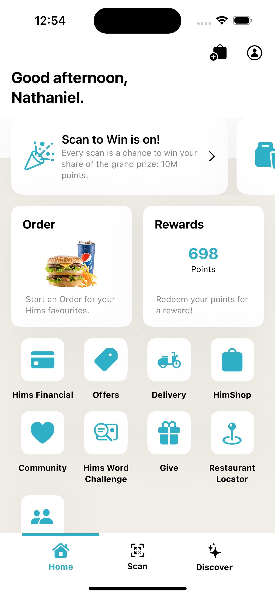
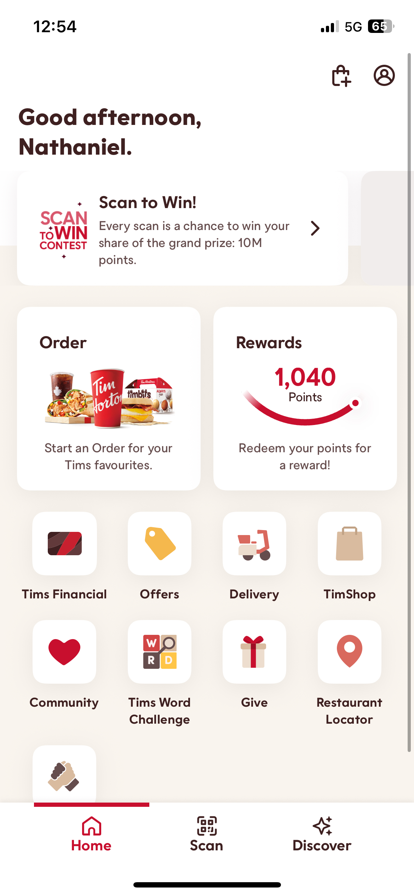
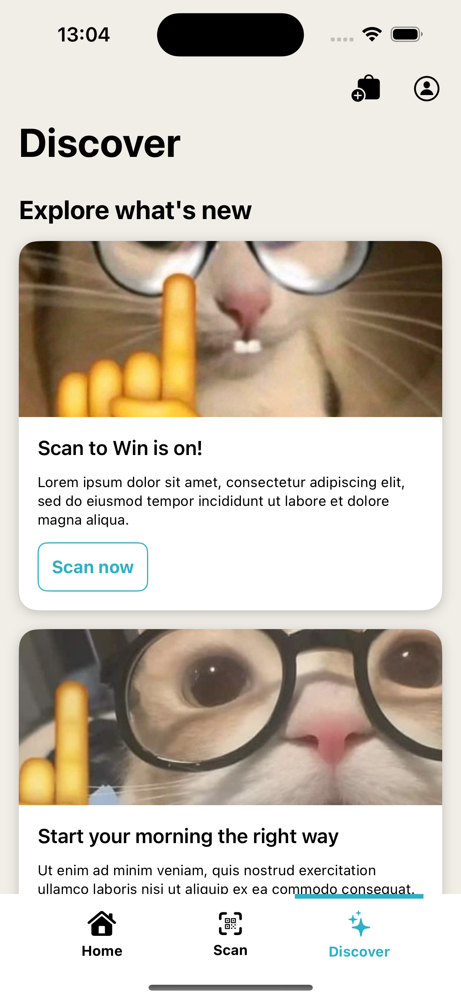
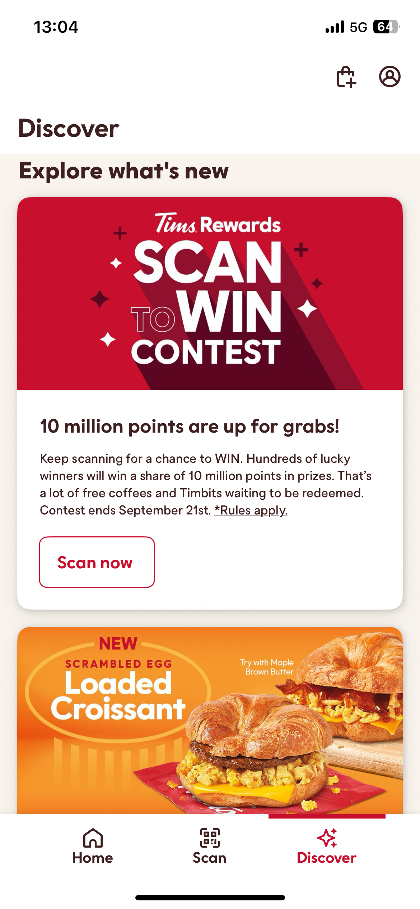

# Him Tortons

Running through recreating a mockup of the Tim Hortons mobile app. The general idea is to apply what I've learnt so far to break down and understand another app's layout visually and figure out how a "real app" is made.

## Home View

  <figure style="display:inline-block; margin: 0 10px; text-align:center;">
    <figcaption><b>Him Tortons</b></figcaption>
    
  </figure>
  <figure style="display:inline-block; margin: 0 10px; text-align:center;">
    <figcaption><b>Tim Hortons</b></figcaption>
    
  </figure>

## Scan View

Coming soon

## Discover View

  <figure style="display:inline-block; margin: 0 10px; text-align:center;">
    <figcaption><b>Him Tortons</b></figcaption>
    
  </figure>
  <figure style="display:inline-block; margin: 0 10px; text-align:center;">
    <figcaption><b>Tim Hortons</b></figcaption>
    
  </figure>

